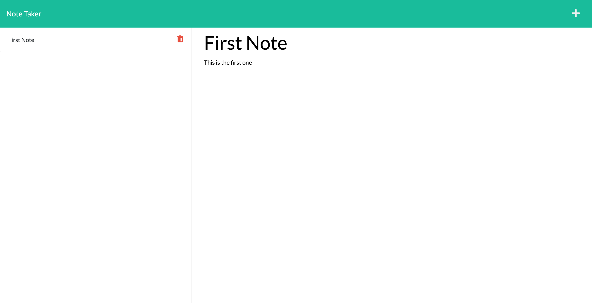
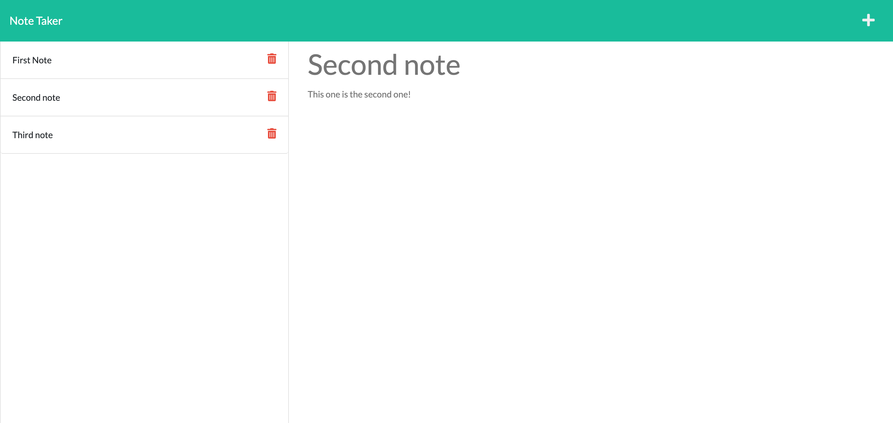

# Note Taker

This is a simple note taker app created for my own personal practice with expressJS. Users are able to create notes, save them to a list on the side of the screen, view the full note by clicking it, as well as delete notes. 

Application Link

## Technology Used
    HTML
    CSS
    JavaScript
    NodeJS

## Libraries Used
    ExpressJS - Used for the back end routing
    UUID - Used for generating random ID's on new notes.

## Live Link

Deployed app : https://stark-depths-96058.herokuapp.com/ 

## Screenshot

